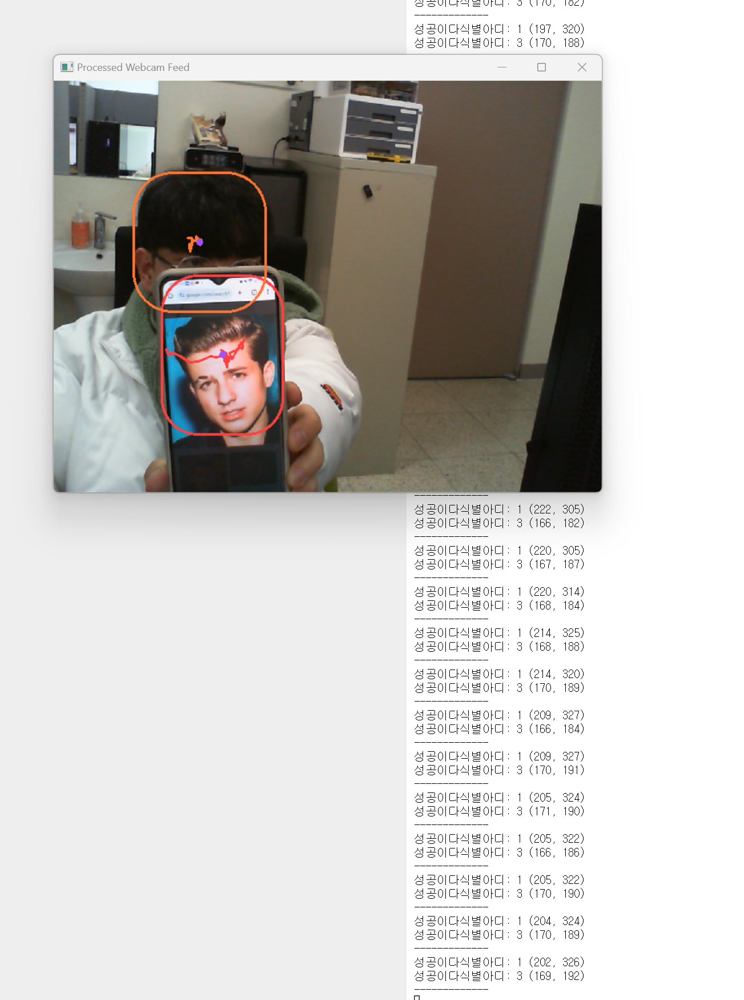

# 2024.03.18 심화캡스톤 다중 객체 추적 실시간입니다!😿

yolov9와 bytetrack을 이용하여 실시간 다중 객체 추적을 했습니다.

밑에 링크는 열심히 탐구탐구한 욜로9 깃허브입니다.
https://github.com/WongKinYiu/yolov9

pt파일을 직접 만들었고 실시간 추적 코드를 짰습니다.
밑에는 실행사진 및 영상입니다

111.py는 gpu확인용 코드입니다

# 결과 사진

찰리푸스 노래 좋아여

## 실행 방법
1. 아나콘다 가상환경 생성(파이썬 버전 >=3.8) " conda create -n {가상환경이름} python=3.8 "
2. 아나콘다 가상환경 실행 " conda activate {가상환경이름} "
3. 주피터노트북 설치합시다 " pip install jupyter notebook "
4. 레파지토리 다운 받을 경로로 가서 다운하" git clone https://github.com/redkye2/detection-and-tracking_real-time.git "
5. 이름 쉽게 지을껄... 경로 이동 " cd detection-and-tracking_real-time "
6. 라이브러리 깔기 " pip install -r requirements.txt "
7. 주피터 노트북 실행 " jupyter notebook "
8. cpu, gpu를 미리 333.py에서 설정해주기
9. 터미널에서 " python 333.py "
10. 짜잔
